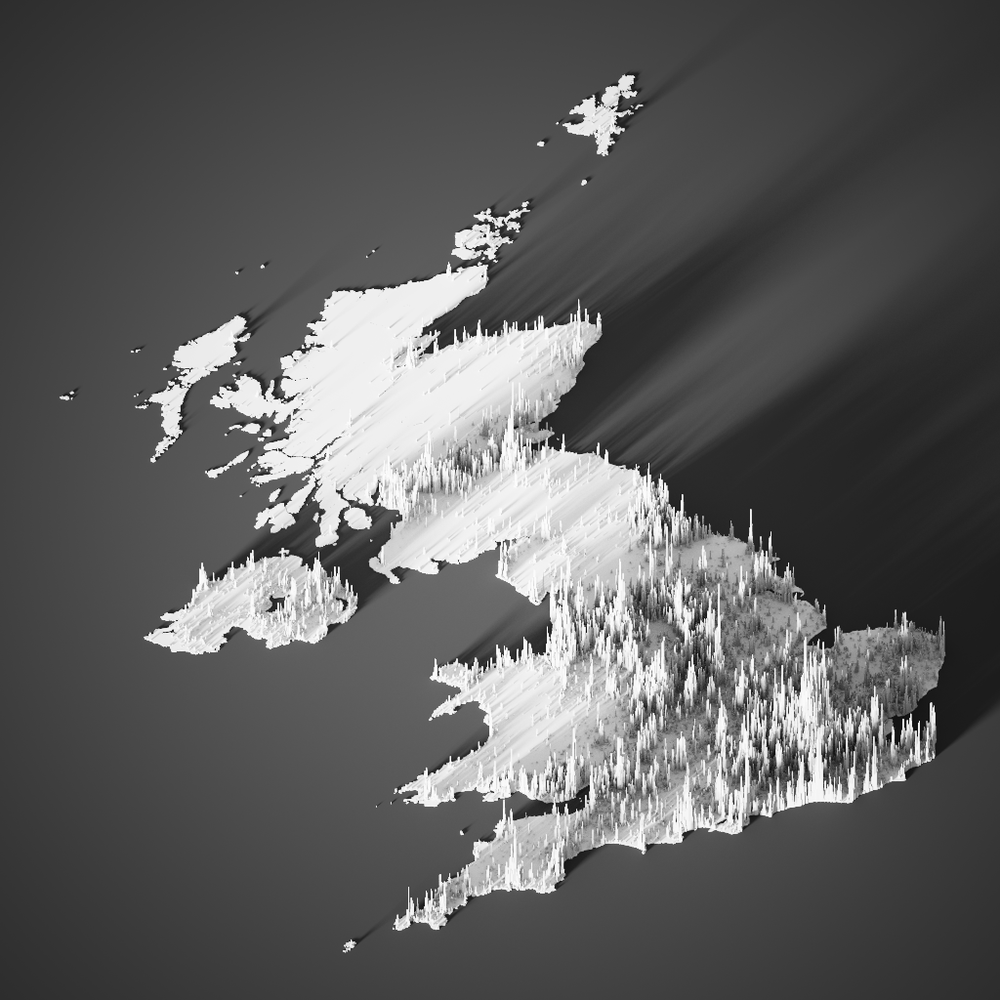

# Population Density map of the United Kingdom

2020 population density data from [worldpop](https://www.worldpop.org/geodata/summary?id=44435).  Each column represesent a 1x1 km area.  Programs used: 
- [QGIS](https://qgis.org/en/site/)  
- [Aerialod](https://ephtracy.github.io/index.html?page=aerialod)

Data was optimised using QGIS and later coloured and fine tuned with Aerialod.
Tutorial used from [statsmapsnpix](http://www.statsmapsnpix.com/2020/11/how-to-make-3d-population-density.html)

